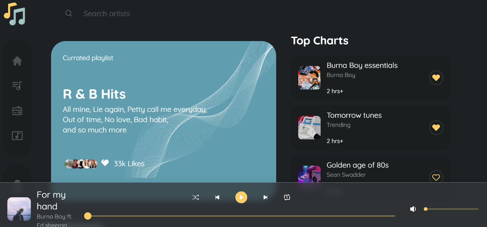

# Musica App

### About the maintainer
I am Uchechukwu Nwankwo and I'm a Full Stack developer. I work with ReactJS for building frontend applications as well as Node.js for building backends. My go-to database management system is MongoDB, nevertheless I am also proficient using PostgreSQL.

- [**LinkedIn**](https://linkedin.com/in/uchechukwu10)
- [**Twitter**](https://twitter.com/Maazi_Of_042)
- [**Portfolio**](https://github.com/Uchechukwu10/Personal-Portfolio)

### About the Project
Musica is inspired by an online coding challenge by @codingossy on twitter. It seeks to create a music playing platform with basic functionalities.

### Implemented Features
- Initial implementation of styles according to the [Figma File](https://figma.com)
- Search Functionality
- Play and Pause functionality
- Next, Previous, Repeat functonalities
- Navigation around application

### Yet to be implemented features
- Shuffle button for each playlist
- Animations for specific components and inter-page transitions
- Re-factoring of code styling
- Responsiveness across all screens

## Contributing
1. Create an issue clearly describing the change you want to implement
2. Fork this repository
3. Clone your forked repository into your local machine in your desired folder
4. cd into the project folder
5. Run `npm install`
6. Access the code base and make desired changes
7. Commit and push your changes to your forked repository
8. Make a pull request to merge into the original repository
9. Your pull request will be checked and merged if it passes
